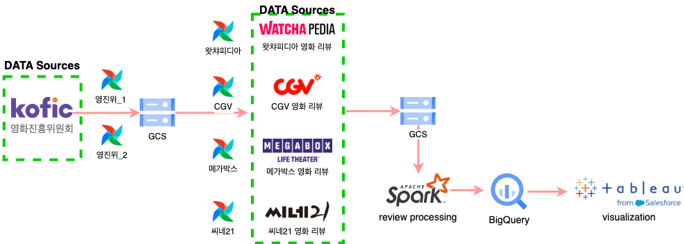
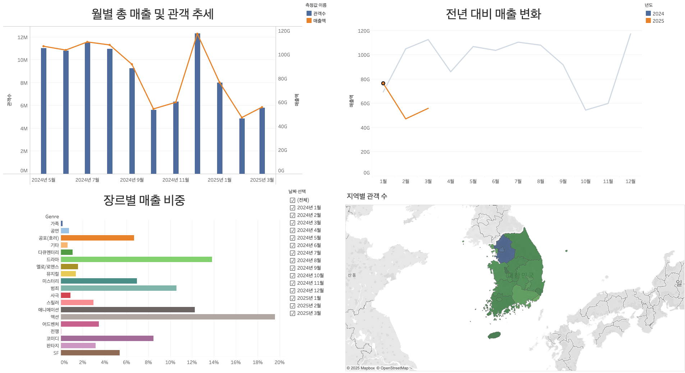
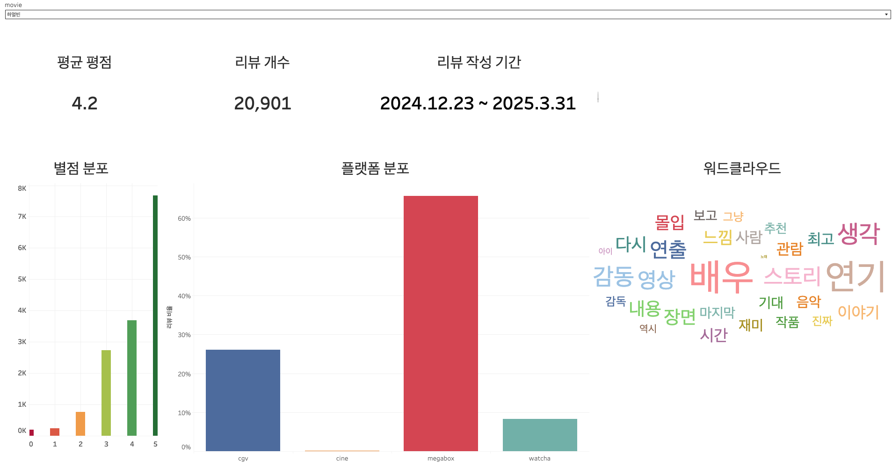
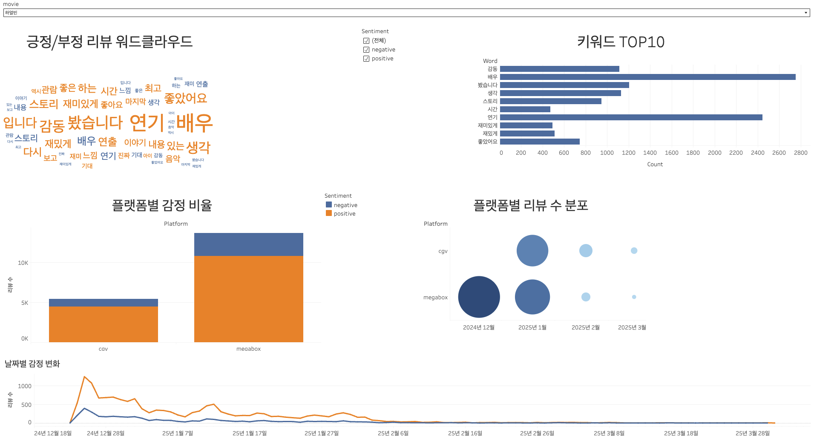

# 🎬 Movie Review Visualization Project

영화 박스오피스 및 리뷰 데이터를 수집·분석하여 시각화 대시보드를 제작한 프로젝트입니다.  
일간 박스오피스와 다양한 플랫폼에서 수집한 리뷰 데이터를 바탕으로 **영화별 리뷰 흐름, 감정 분석, 추천 키워드 등 인사이트를 도출**합니다.


<br>

## ✅ 프로젝트 개요

- **목표**: 영화 박스오피스 및 리뷰 데이터를 분석하여, 관객 반응과 시장 트렌드를 시각화하고 마케팅 전략 수립에 활용할 수 있는 인사이트를 제공
<br>

- **데이터 수집 기간**: 2025.03.25 ~ 2025.04.14
- **사용 기술**:
  - **언어 & 분석**: Python, SQL, PySpark
  - **데이터 엔지니어링**: Airflow, Selenium, BeautifulSoup, Pandas
  - **감성 분석**: HuggingFace Transformers
  - **저장소**: GCP (GCS, BigQuery)
  - **시각화**: Tableau


<br>

## 📁 폴더 구조
```bash
Inside_Movie/
├── .github/workflows/             
├── dags/                          
    ├── boxoffice_crawling_and_upload/        
    ├── review_crawler/            
    └── process_and_analysis/      
├── get_region_code.py             
├── spark_process_etl.ipynb        
├── poetry.lock                    
├── pyproject.toml                 
└── README.md                      
```
+ `.github/workflows/` <br>
GitHub Actions를 이용한 CI/CD 자동화 설정 디렉토리 <br>

<br>

+ `dags/` <br>
Apache Airflow DAG 모음 디렉토리 <br>
├─ `box_office_crawler/` : 일별/지역별 박스오피스 데이터 수집 및 접처리 후 BigQuery 업로드 DAG <br>
├─ `review_crawler/` : CGV, Megabox, Watcha 등 리뷰 수집 DAG <br>
└─ `process_and_analysis/` : 수집된 데이터 전처리 및 분석 DAG <br>

<br>

+ `get_region_code.py` <br>
Open API를 활용하여 지역 코드를 추출하는 스크립트 <br>

<br>

+ `spark_process_etl.ipynb` <br>
프로젝트 초기 단계에서 Pandas와 Spark로 수행한 데이터 전처리 노트북

<br>

+ `poetry.lock` / `pyproject.toml` <br>
가상환경 설정 및 Python 의존성 관리 파일 (Poetry 사용)

<br>

+ `README.md` <br>
프로젝트 개요, 구조, 실행 방법 등을 담은 문서


<br>

## 🗂️ 아키텍처



<br>

## ⚙️ 주요 기능


| 기능 | 설명 |
|------|------|
| 📦 **박스오피스 데이터 수집** | KOBIS API를 활용하여 **일별·지역별 박스오피스 데이터 자동 수집**<br>Airflow DAG으로 매일 실행 |
| 📝 **리뷰 데이터 수집** | Watcha, CGV, Megabox, Naver 등 **다양한 플랫폼의 리뷰 자동 크롤링**<br>영화별·날짜별로 저장 |
| 🧹 **리뷰 전처리 및 병합** | 플랫폼마다 다른 포맷의 리뷰를 정제·병합<br>중복 제거, 특수문자 정리 등 수행 (Pandas / PySpark) |
| 💬 **감정 분석 (Sentiment Analysis)** | 리뷰 문장을 **긍정 / 부정 감정으로 분류**<br>원본 감정 점수와 분류 결과를 함께 저장 |
| 🔍 **키워드 분석 (Keyword Extraction)** | 형태소 분석기를 사용해 **리뷰 내 주요 키워드 추출**<br>빈도 기반 워드클라우드용 데이터 생성 |
| ☁️ **BigQuery 적재 및 시각화** | GCS → BigQuery로 전처리 데이터 업로드<br>**Tableau를 통한 대시보드 시각화** (감정 추이, 키워드, 별점 등) |


<br>

## 📊 대시보드 예시 및 인사이트
### 1️⃣ 박스오피스 데이터 분석



- **월별 총 매출 및 관객 추이**를 시각화하여, 영화 시장의 흐름을 파악할 수 있습니다.
- **전년 대비 매출 변화**를 통해 작년과 올해의 시장 상황을 비교할 수 있습니다.
- **장르별 매출 비중**과 **지역별 관객 수 분포**를 통해 타깃 장르와 지역 기반 마케팅 전략 수립이 가능합니다.

<br>

🔍 **주요 인사이트**
- **월별 총 매출 및 관객 추이**를 통해 영화 시장의 계절성과 트렌드 흐름을 파악
- **전년 대비 매출 변화**는 시장 회복 또는 침체 흐름을 진단하는 데 도움
- **장르별 매출 비중**으로 시기별 선호 장르 경향 파악
- **지역별 관객 수 분포**에서는 지역별 상위 10개 박스오피스 영화를 함께 제공하여, 지역별 선호 장르 및 인기 영화의 특성을 비교 분석할 수 있습니다.

<br>

### 2️⃣ 영화 리뷰 요약 분석


- 영화별 **평균 평점, 리뷰 수, 작성 기간**을 요약해 비교 분석이 가능합니다.
- **별점 분포**, **플랫폼별 리뷰 분포**, **워드클라우드**를 통해 관객 반응의 전반적인 흐름을 파악할 수 있습니다.

<br>

🔍 **주요 인사이트**
- **플랫폼 분포**와 **평균 평점**을 비교하면, 관객 반응이 활발한 플랫폼과 사용자 성향을 분석
- **리뷰 작성 기간**을 통해 관객의 관심이 일시적인지, 장기간 이어졌는지를 판단할 수 있으며, 지속적으로 리뷰가 작성된 영화는 높은 인기도와 재관람 가능성을 시사
- **별점 분포** 분석을 통해 관객의 전반적인 만족도와 불만 요소를 파악
- **워드클라우드**를 통해 관객이 주목한 요소(예: 연기, 스토리, 영상미 등) 시각화

<br>

### 3️⃣ 감정 분석 및 키워드 인사이트



- **긍/부정 리뷰를 분리해 워드클라우드**를 제공하고 **키워드 TOP10** 분석을 제공합니다.
- **플랫폼별 감정 비율**, **날짜별 감정 추이**, **플랫폼 별 리뷰 수 분포**도 함께 시각화합니다.

🔍 **주요 인사이트**
- **플랫폼별 감정 비율**를 통해 이용자층의 성향 차이나 반응 특성을 파악
- **플랫폼별 리뷰 수 분포**에서는 상영 중인 플랫폼별 마케팅 전략 수립 가능
- **날짜별 감정 변화**를 분석하면, 시간 흐름에 따라 반응이 어떻게 변했는지 시각적으로 파악할 수 있습니다.
- **긍/부정 워드클라우드**를 통해 어떤 요소가 호감/비호감을 유발했는지 분석 가능

<br>

## 🛠 실행 방법
### 1️⃣ 환경 설정
#### 📦 Poetry 가상환경 생성 및 패키지 설치

```bash
# poetry 설치 (필요 시)
pip install poetry

# 프로젝트 디렉토리로 이동
cd Inside_Movie/

# 의존성 설치 및 가상환경 생성
poetry install

# 가상환경 활성화
poetry shell
```

<br>

### 2️⃣ Airflow 초기 설정
```bash
# Airflow 환경 변수 설정 (예시)
export AIRFLOW_HOME=~/airflow
airflow db init
airflow users create \
    --username admin \      # 다른 username 설정 가능
    --password admin \      # 다른 password 설정 가능
    --firstname "본인 이름" \
    --lastname "본인 이름" \
    --role Admin \
    --email 이름@example.com

# DAG 실행용 스케줄러 및 웹서버 실행
airflow scheduler &
airflow webserver --port 8080
```
+ 웹 브라우저에서 `http://localhost:8080` 접속 → DAG 실행

<br>

### 3️⃣ DAG 실행
```bash
# 원하는 DAG 수동 실행
airflow dags trigger box_office_crawler
airflow dags trigger review_crawler
airflow dags trigger process_and_analysis
```
+ 또는 웹에서 DAG 이름을 클릭하여 수동 실행 가능

<br>

### 4️⃣ GCS / BigQuery 연동
+ `.env` 또는 환경 변수에 GCP 인증 키 설정 (GOOGLE_APPLICATION_CREDENTIALS)
+ 각 DAG 실행 시, 전처리된 데이터는 GCS에 저장되고 BigQuery에 적재됩니다.
+ GCP 프로젝트 내 BigQuery에서 테이블 확인 가능

<br>

### 5️⃣ Tableau 대시보드 연동
1. Tableau Public 또는 Desktop에서 BigQuery 커넥터 연결
2. `리뷰`, `박스오피스`, `감정 분석` 등 BigQuery 테이블 연결
3. 커스터마이징 후 대시보드 제작 및 퍼블리싱

<br>

## 📌 향후 개선 방향

- ☁️ **클라우드 기반 파이프라인 전환**
  - 현재는 로컬 환경에서 데이터 수집 및 분석이 이루어지고 있으나, 향후에는 GCP VM 등의 클라우드 환경으로 전환하여 **크롤링 자동화와 실행 환경 통합 관리**를 추진할 계획입니다.

- 🔄 **CI/CD 및 운영 자동화 고도화**
  - GitHub Actions를 통해 코드 변경 시 자동 배포되도록 구성하였으며, 향후에는 **Airflow DAG 실패 시 Slack 알림 연동**을 추가하여 전체 파이프라인의 안정성과 운영 편의성을 높일 예정입니다.

- 🧠 **감정 분석 정확도 향상**
  - 현재 사용 중인 모델은 `sangrimlee/bert-base-multilingual-cased-nsmc`로, 네이버 영화 리뷰 데이터 기반의 BERT 모델입니다.  
  - 향후에는 **도메인 맞춤형 fine-tuning**, 또는 **모델 경량화 및 서빙 자동화**를 통해 운영 효율을 높일 수 있습니다.